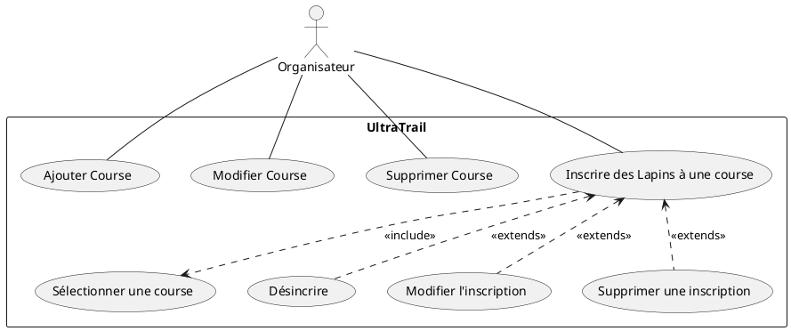
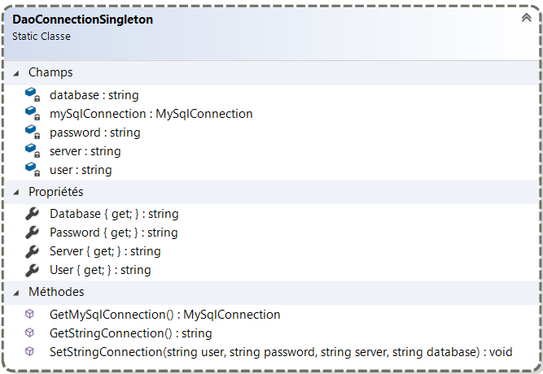
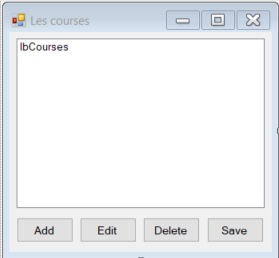
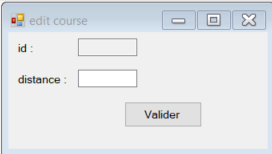

# UTDL - Ultra Trail De Lapins

Ce projet sert à simuler un ultra trail de lapins, en gérant les lapins et les courses avec une base de données.


## ⚠️ Compilation du projet

Projet à compiler dans cet ordre :
- `Model` (Aucune dépendance)
- `Dao` (Dépendant de `Model`)
- `View` (Dépendant de `Model` et `Dao`)


## 🗂 Base de données

Le script SQL `/bd/CreateDbUtdl.sql` permet de créer la base de données.

### Table Course
```sql
create table Course (
    id int(11) unsigned not null auto_increment,
    distance int(11) unsigned not null,
    index(id)  
);
```

### Table Lapin

```sql
create table Lapin (
    id int not null auto_increment,
    surnom varchar(20) not null,
    position int(11) unsigned,
    dossard int(11) unsigned,
    age int(11) unsigned not null,
    idCourse int(11) unsigned not null,
    index(id)
);
```

### Contraintes
```sql
alter table Course add constraint pk_Course primary key (id);
alter table Lapin add constraint pk_Lapin primary key (id);
alter table Lapin add constraint fk_Lapin_Participer_Course foreign key (idCourse) references Course(id);
alter table Lapin add index idx_idCourse (idCourse);
```


## 👤 Organisateur : diagramme de cas d'utilisation




## 🔓 Connection à la base de donnée

L'accesseur GetMySqlConnection() garantit qu'il n'existe qu'une seule instance de connexion à la base de données.

{height=300}

Instancier la connexion dans le constructeur de la Windows Form `FultraTrail`, permettant ainsi à toute l'application d'accéder à la base de données.

```c# 
public FultraTrail() {
    InitializeComponent();
    this.btnLesCourses.Click += this.btnLesCourses_Click;
    this.btnUneCourse.Click += this.btnUneCourse_Click;
    DaoConnectionSingleton.SetStringConnection("root","siojjr","localhost","dbUtdl");
}
```


## 🏅 Vues sur les courses

## FlesCourses - Afficher les courses

Fenêtre affichant les courses (en utilisant `DaoCourse`) :



```c#
public partial class FlesCourses:Form {
    public FlesCourses() {
        InitializeComponent();
        btnAdd.Click += this.btnAdd_Click;
        btnEdit.Click += this.btnEdit_Click;
        btnDelete.Click += this.btnDelete_Click;
        btnSave.Click += this.btnSave_Click;
        this.load(new DaoCourse().GetAll());
    }

    private void btnSave_Click(object sender,System.EventArgs e) {
        List<Course> courses = new List<Course>();
        foreach(object o in lbCourses.Items) {
            courses.Add((Course)o);
        }
        new DaoCourse().SaveChanges(courses);
        this.load(courses);
    }

    private void btnDelete_Click(object sender,System.EventArgs e) {
        if (lbCourses.SelectedIndex == -1) return;
        int position = lbCourses.SelectedIndex;
        ((Course)lbCourses.Items[position]).Remove();
        lbCourses.Items[position] = lbCourses.Items[position];
    }

    private void btnEdit_Click(object sender,System.EventArgs e) {
        if (lbCourses.SelectedIndex == -1) return;
        int position = lbCourses.SelectedIndex;
        FeditCourse fEdit = new FeditCourse(State.modified, lbCourses.Items, position);
        fEdit.Show();
    }

    private void btnAdd_Click(object sender,System.EventArgs e) {
        FeditCourse fEdit = new FeditCourse(State.added, lbCourses.Items, 0);
        fEdit.Show();
    }

    private void load(List<Course> courses) {
        lbCourses.Items.Clear();
        foreach(Course c in courses) {
            lbCourses.Items.Add(c);
        }
    }
}

```

## FeditCourse - Créer/modifier une course




```c#
public partial class FeditCourse:Form {
    State state;
    ListBox.ObjectCollection items;
    int position;

public FeditCourse(State state,ListBox.ObjectCollection items,int position) {
    InitializeComponent();
    btnValider.Click += this.btnValider_Click;
    this.state = state;
    this.items = items;
    this.position = position;
    switch(state) {
        case State.added:
            this.Text = "Création d'une course";
            break;
        case State.modified:
            Course course = (Course)items[position];
            this.tbId.Text = course.Id.ToString();
            this.tbDistance.Text = course.Distance.ToString();
            this.Text = "Modification d'une course";
            break;
        case State.deleted:
            this.Text = "Suppression d'une course";
            break;
        case State.unChanged:
            this.Text = "Consultation d'une course";
            break;
        default:
            break;
    }
}

private void btnValider_Click(object sender,EventArgs e) {
    switch(this.state) {
        case State.added:
            items.Add(new Course(0,Convert.ToInt32(this.tbDistance.Text),this.state));
            break;
        case State.modified:
            Course course = (Course)items[this.position];
            course.Distance = Convert.ToInt32(this.tbDistance.Text);
            course.State = this.state;
            items[this.position] = course;
            break;
        case State.deleted:
            break;
        case State.unChanged:
            break;
        default:
            break;
    }
    this.Close();
}
```